# WVD :- Windows Virtual Desktop

COVID-19 pandemic made many organization to let their employee work from home. The main challenge for any organization is to make sure their employees are as productive as they are in office. This will include security, access to equipment,large number of users accessing VPN connection etc.

[Microsoft Azure Windows Virtual Desktop aka WVD](https://azure.microsoft.com/en-us/services/virtual-desktop/) is a service on Azure that could be one part of a COVID-19 response plan. With WVD, we no longer need to be concerned with the constraints of the physical hardware or a person's location.

In this blog post I will be using my MSDN subscription to spin up the WVD instead of my official subscription (as I am not an administrator). That's means I already have my tenant and AAD setup. Please [use this link](https://azure.microsoft.com/en-us/free/) to spin up a new Microsoft Azure Account. 

## Steps to spin Windows Virtual Desktop. 

        Step 1:- Setup a user account and assign role assignment

        Step 2:- Provision Azure Active Directory Domain Services

        Step 3:- Provision a Windows Virtual Desktop Tenant Creator account

        Step 4:- Deploy Windows Virtual Desktop in Azure


### Step 1:- Setup a user account and assign role assignment

* Open http://portal.azure.com in a web browser

* Once loggedin, click Azure Active Directory from left side pane

* Click Users and then "+ New User"

* Add new user details

      

* Click Create

* Once user is created, let's assign role assignment

* Click Assigned roles

    

 * Click "+ Add assignments" and assign "User administrator" role

    

```
    Note:- You need to change the user password When you login first time 
```

### Step 2:- Provision Azure Active Directory Domain Services

    As per the documentation, there are 3 ways to configure domain services

        1 Deploy a domain controller in a hosted Windows Server VM running in Azure

        2 [x] Provision Azure Active Directory Domain Services 
   
        3 Connect your network to Azure and establish a VPN between your datacenter and Azure

* Provision [Azure Active Directory Domain Services](https://docs.microsoft.com/en-us/azure/active-directory-domain-services/tutorial-create-instance).

* Search Azure AD Domain Serivces, select and click create

    

* Provide subscription name, DNS domain name etc and click Create

    

* It will take sometime to provision Azure Active Directory Domain Services

    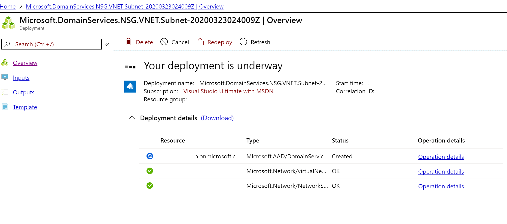

* Once Azure AD Domain Services is created, click "Configure" for " Update DNS server settings for your virtual network"

    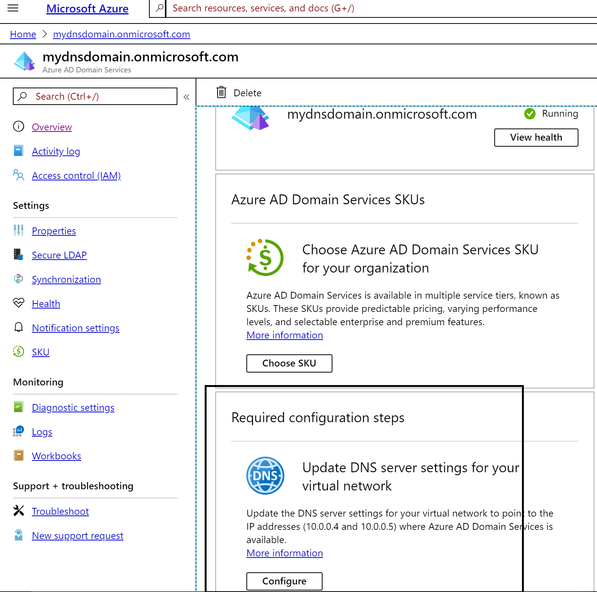

* Once it's done, DNS servers for virtual network will get configured

    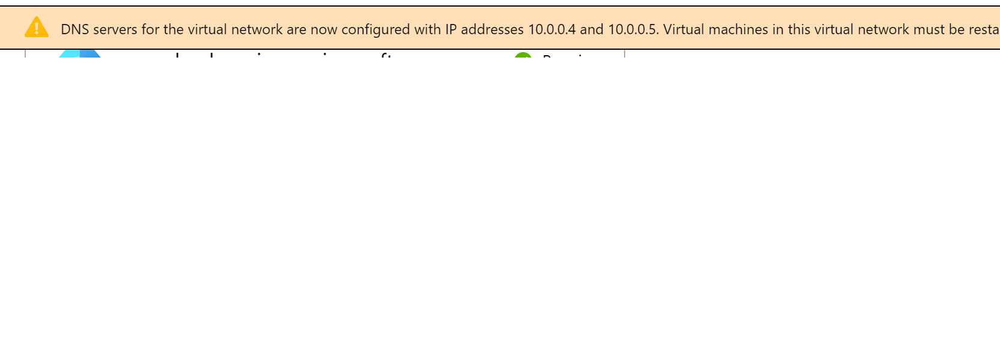

* Copy Azure AD Domain Services like XXXXdomain.onmicrosoft.com


### Step 3:- Provision a Windows Virtual Desktop Tenant Creator account

* Copy Azure Active Directory Tenant GUID from Azure portal

    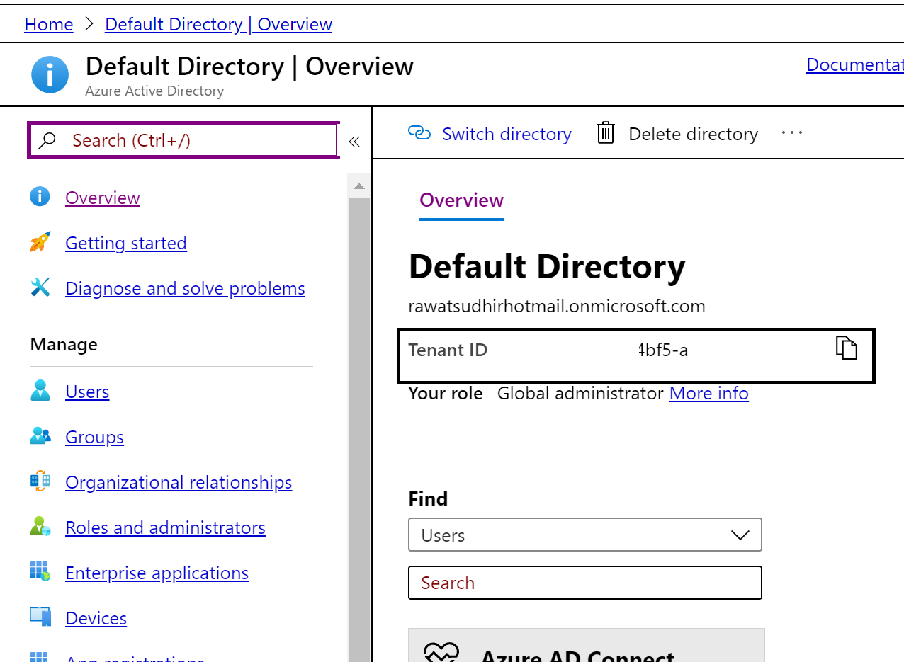

* Goto https://rdweb.wvd.microsoft.com and provide consent to Windows Virtual Desktop ( "Server App" and "Client App" )

    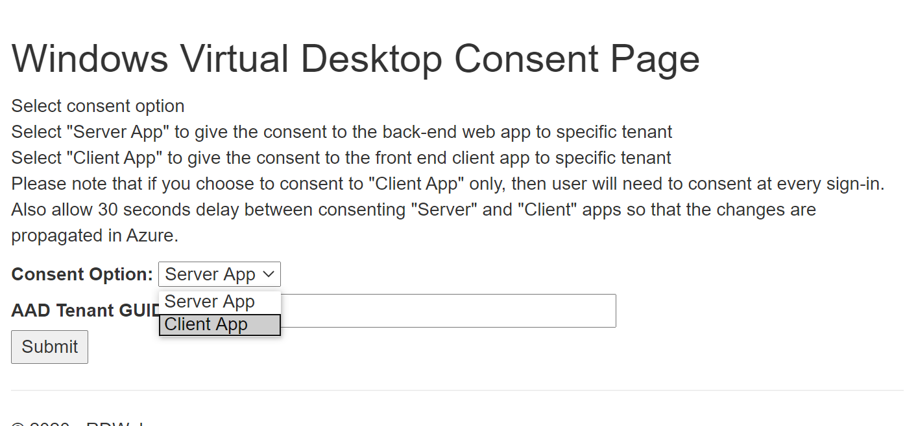

* Once consent is given, goto Azure Active Directory then "Enterprise applications"

    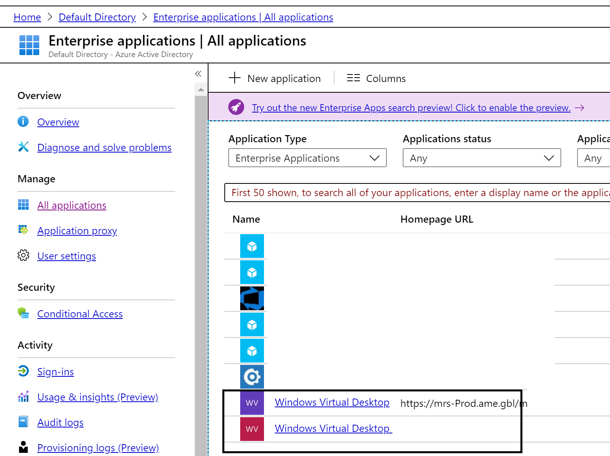

* Run Windows PowerShell ISE as administratre

    ```
        Import-module Microsoft.Rdinfra.RdPowershell
        Install-module Microsoft.Rdinfra.RdPowershell
        Add-RdsAccount –DeploymentURL "https://rdbroker.wvd.microsoft.com"
        New-RdsTenant -Name <TenantName> -AadTenantID <DirectoryID> -AzureSubscriptionID <SubscriptionID>

        Note:- Provide any name for Tenant, copy DirectoryID/TenantID from Azure Active Directory and SubscriptionID from Azure portal 
    ```
* Execute the command (Sign in with the credentials for a user with the Tenant Creator role)

    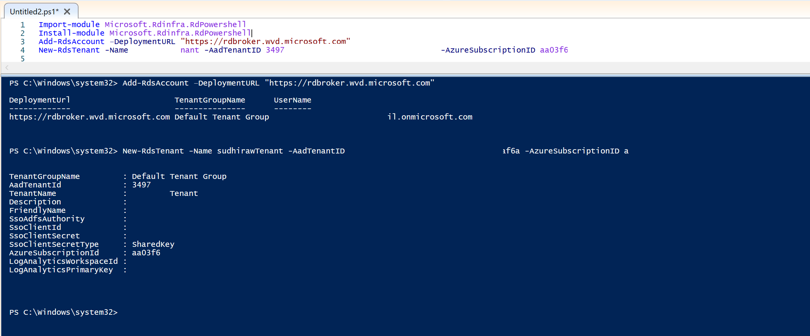

* Copy tenant name

### Step 4:- Deploy Windows Virtual Desktop in Azure

* Goto Azure portal and search for "Windows Virtual Desktop" and Select "Windows Virtual Desktop - Provision a host pool"

    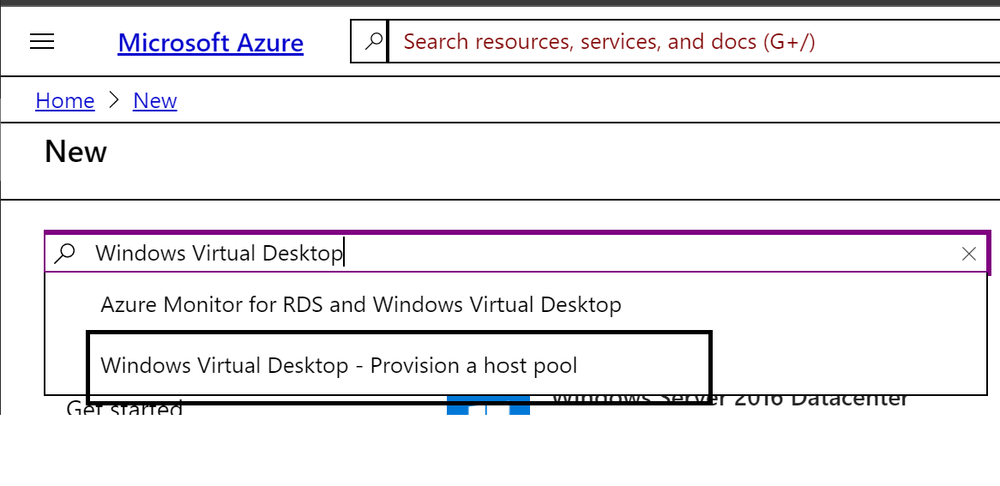

* Click Create

* Provide resource group name, Host pool name, Desktop type, Default desktop users

    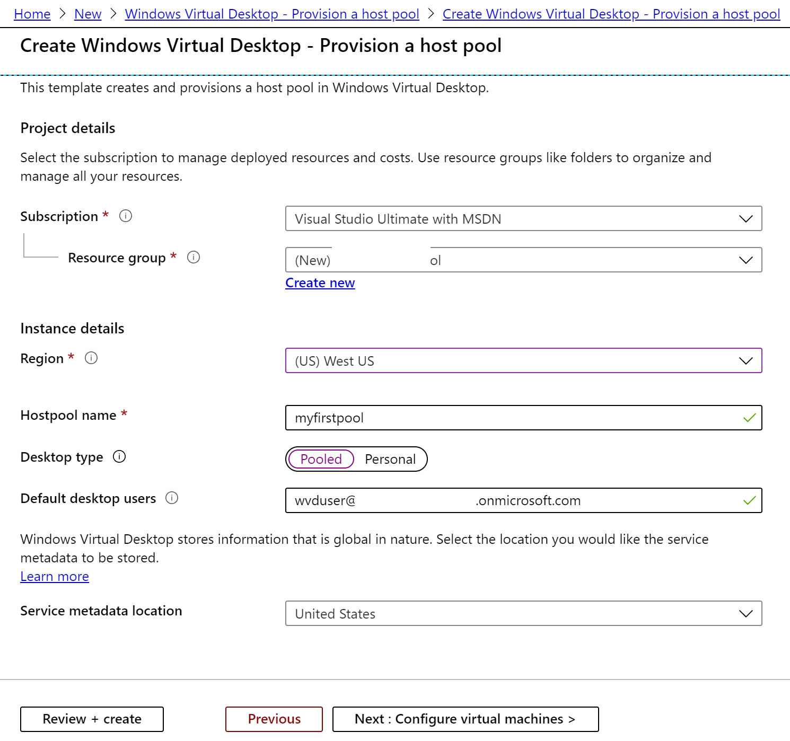

```
        Note:- Pooled:- When you want multiple users (session) to access same VM. Personal :- When one user access the VM. 
```

* Click "Next : Configure virtual machines > ". Provide Usgae Profile, Total users, VM size etc. Depending on usgae profile and Total users, Azure recommends the VM size. However you can change the VM size.

    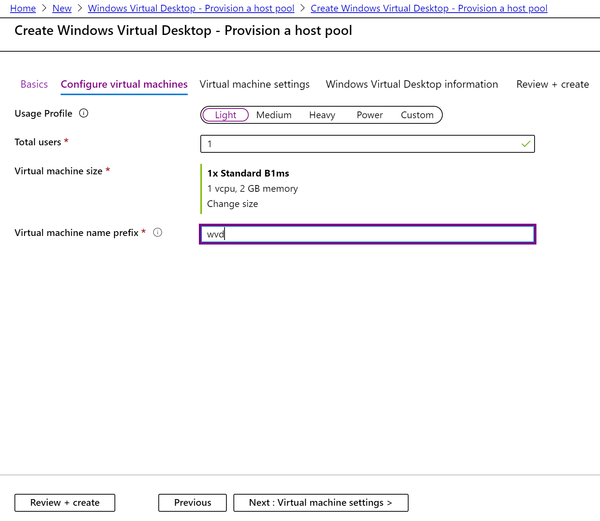

* Click "Next: Virtual machine settings >". Provide information as per below image (Do select Yes for "Specify domain or OU" to yes and provide the "Domain to join" created earlier). Click "Next : Windows Virtual Desktop information >" 

    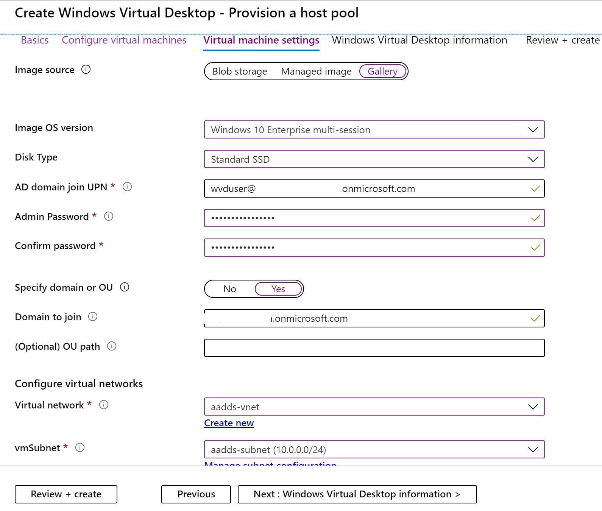

* Provide "Windows Virtual Desktop tenant name" created in ealrier step, UPN/Service principal. Click "Next : Review + create >"

    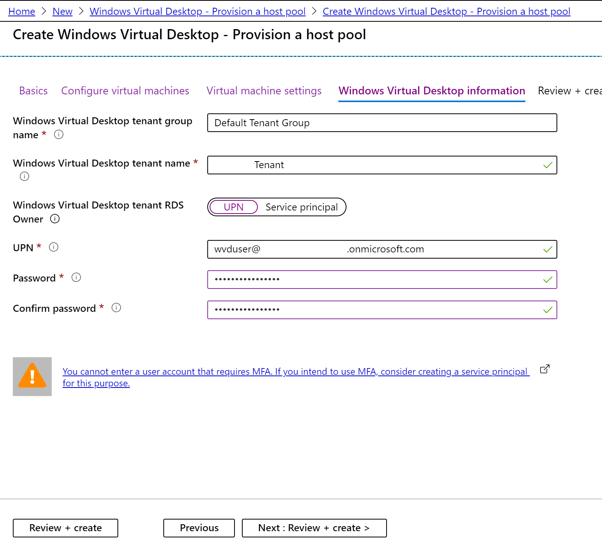

* Once Validation pass, click Create 

    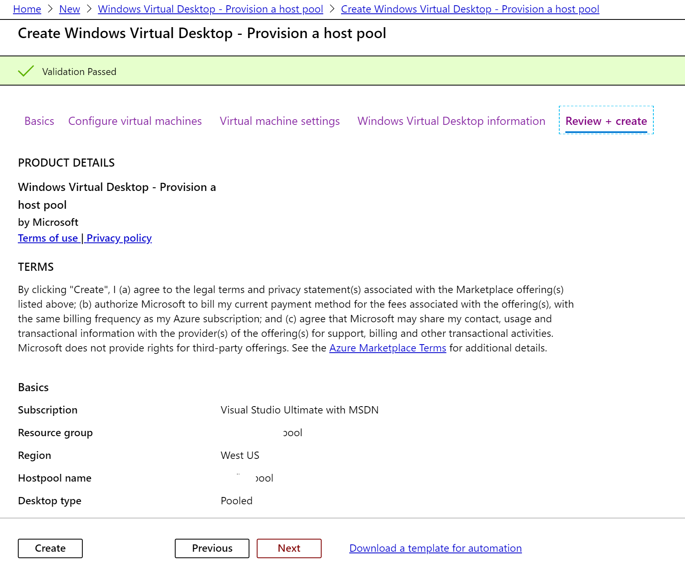


