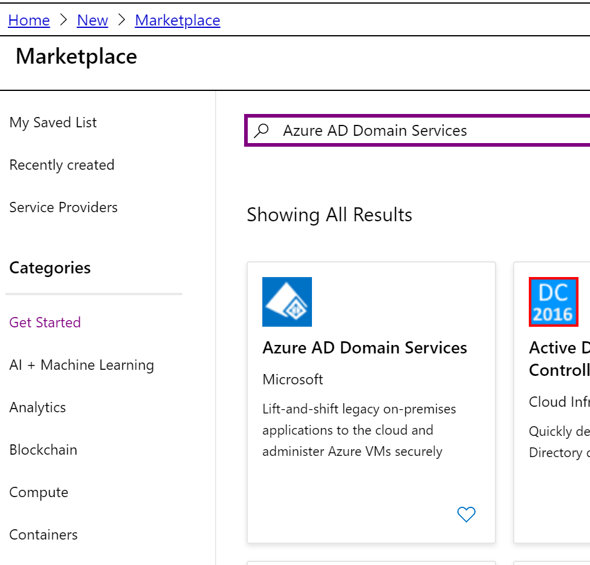
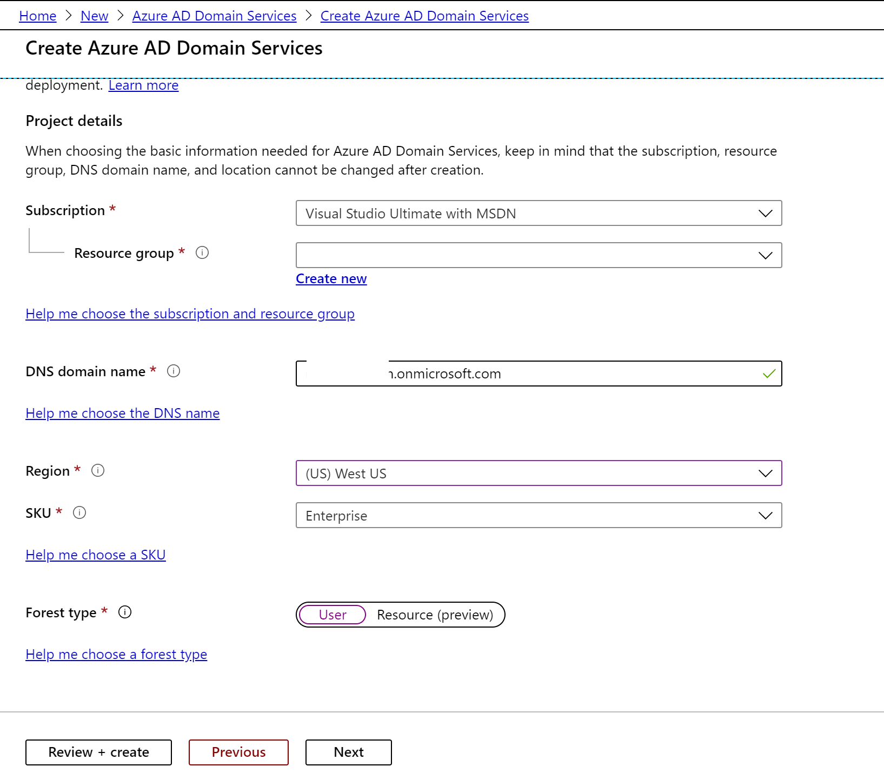

# WVD :- Windows Virtual Desktop

COVID-19 pandemic made many organization to let their employee work from home. The main challenge for any organization is to make sure their employees are as productive as they are in office. This will include security, access to equipment, large number of users accessing VPN connection etc.

[Microsoft Azure Windows Virtual Desktop aka WVD](https://azure.microsoft.com/en-us/services/virtual-desktop/) is a service on Azure that could be one part of a COVID-19 response plan. With WVD, we no longer need to be concerned with the constraints of the physical hardware or a person's location.

In this blog post I will be using my MSDN subscription to spin up the WVD instead of my official subscription (as I am not an administrator). That's means I already have my tenant and AAD setup. Please [use this link](https://azure.microsoft.com/en-us/free/) to spin up a new Microsoft Azure Account. 

Steps to spin Windows Virtual Desktop. 

Step 1:- Setup a user account and assign role assignment

Step 2:- Provision Azure Active Directory Domain Services

Step 3:- Provision a Windows Virtual Desktop Tenant Creator account

Step 4:- Deploy Windows Virtual Desktop in Azure

Step 1:- Setup a user account and assign role assignment

* Open http://portal.azure.com in a web browser
* Once loggedin, click Azure Active Directory from left side pane
* Click Users and then "+ New User"
* Add new user details
  
* Click Create
* Once user is created, let's assign role assignment 
* Click Assigned roles
 
 * Click "+ Add assignments" and assign "User administrator" role
 

Step 2:- Provision Azure Active Directory Domain Services

As per the documentation, there are 3 ways to configure domain services

 1 Deploy a domain controller in a hosted Windows Server VM running in Azure

 2 Provision Azure Active Directory Domain Services 
   
 3 Connect your network to Azure and establish a VPN between your datacenter and Azure

* I will be provisioning [Azure Active Directory Domain Services](https://docs.microsoft.com/en-us/azure/active-directory-domain-services/tutorial-create-instance).

* Click "Deploy to Azure" 
    
* Replace XXXX with real value
* Accept "Terms and Conditions" 
* Click Purchase
* It will take sometime to provision Azure Active Directory Domain Services
    

